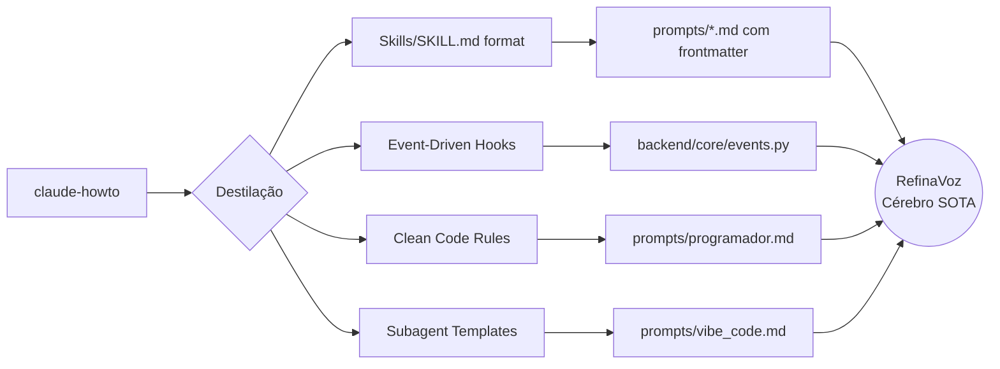

# 🧠 Destilação Profunda: claude-howto → RefinaVoz

> Análise fria, calculista e sem viés do repositório `luongnv89/claude-howto`
> (19.8k ⭐, MIT, v2.2.0 Março 2026).
> 
> **Duas perguntas, duas respostas absolutas.**

---

## Pergunta 1: Esse material serve para calibrar o ambiente Vibe Code?

### Veredicto: **SIM — com alto impacto.**

O `claude-howto` é literalmente um manual operacional de técnicas que o Antigravity
**já implementa internamente**, mas que voce como usuário nunca configurou para o
seu projeto. Aqui está o mapa de tradução direta:

| Conceito no `claude-howto` | Equivalente no Antigravity | O que você ganha |
|---|---|---|
| **Slash Commands** (`.claude/commands/*.md`) | **Workflows** (`.agents/workflows/*.md`) | Atalhos reutilizáveis para tarefas recorrentes |
| **Memory** (`CLAUDE.md`) | **Knowledge Items** (KIs no `brain/`) | Contexto persistente entre sessões |
| **Skills** (`.claude/skills/*/SKILL.md`) | **Skills** (`.agents/skills/*/SKILL.md`) | Capacidades especializadas auto-invocáveis |
| **Subagents** (`.claude/agents/*.md`) | **Browser Subagent** (nativo) | Delegação de tarefas |
| **Hooks** (event-driven scripts) | ⚠️ **NÃO TEM equivalente nativo aqui** | **OPORTUNIDADE ENORME** |
| **Clean Code Rules** (regras de geração) | **User Rules** (configuração global) | Padrão de qualidade do código gerado |

### Ações concretas para calibrar o ambiente:

#### 1. Criar Workflows Antigravity (equivalente aos Slash Commands)
Vamos criar workflows reutilizáveis na pasta `.agents/workflows/`:

- `/review` → Revisão de código automática pós-edição
- `/test` → Gerar e rodar testes para o arquivo atual
- `/refine` → Pegar texto bruto e refinar usando o pipeline RefinaVoz

#### 2. Criar Skills Antigravity para o projeto
Baseado no padrão `SKILL.md` do claude-howto, criar skills locais:

- `code-review/SKILL.md` → Review especializado em FastAPI + Python
- `prompt-engineering/SKILL.md` → Gerar e avaliar prompts XML

#### 3. Injetar Clean Code Rules como padrão do projeto
O `clean-code-rules.md` pode ser destilado diretamente como regras de geração
de código dentro da memória do projeto.

---

## Pergunta 2: Esse material sirve para o Cérebro Cognitivo Semântico do RefinaVoz?

### Veredicto: **SIM — mas seletivamente. Não tudo.**

O repositório tem 10 módulos. Apenas **4 deles** contêm lógica destilável para
o cérebro do RefinaVoz:

### O que EXTRAIR e incorporar:

#### A. Padrão de Skills com YAML Frontmatter
O formato `SKILL.md` é **exatamente** o que o RefinaVoz precisa para seus modos:

```yaml
---
name: modo-programador
description: Refinamento otimizado para termos técnicos e code-switching pt/en
---

# Modo Programador
...regras XML...
```

**Ação**: Migrar nossos `prompts/*.md` para o formato SKILL com frontmatter.
Isso permite que o `prompt_engine.py` carregue metadata (nome, descrição)
junto com o conteúdo, habilitando seleção inteligente de modo.

#### B. Paradigma Event-Driven (Hooks)
O modelo de 25 hooks do Claude Code revela uma verdade arquitetural que nos
falta: **o pipeline do RefinaVoz deveria ser orientado a eventos, não a
chamadas diretas.**

Hoje nosso pipeline é:
```
Frontend → POST /process/texto → router → llm_client → resposta
```

O que o hook-model ensina é que deveríamos ter:
```
PreProcess    → Evento: aplica dicionário
Process       → Evento: chama LLM
PostProcess   → Evento: valida output, loga métricas
QualityGate   → Evento: verifica se o refinamento é fiel à intenção
```

**Ação**: Criar um sistema de hooks interno no backend Python. Não precisa ser
shell scripts como no Claude. Pode ser um `EventBus` simples com decorators:

```python
@hook("pre_process")
def apply_dictionary(text: str, mode: str) -> str: ...

@hook("post_process")
def validate_output(result: ProcessResponse) -> ProcessResponse: ...
```

#### C. Templates de Subagentes como Prompts Modulares
O `code-reviewer.md` tem uma estrutura brilhante:
- Nome e descrição no frontmatter
- Persona definida em 1 linha
- Prioridades ordenadas (1-5)
- Checklist binário
- Formato de saída estruturado

**Ação**: Reescrever nossos prompts de modo (Vibe Code, Programador, etc.)
seguindo exatamente esse padrão de "agente especializado" ao invés de
instruções genéricas.

#### D. Regras de Clean Code como Dicionário Cognitivo
O `clean-code-rules.md` não é sobre "regras de código" para o app em si.
É sobre regras que o **LLM do RefinaVoz precisa conhecer** quando está
operando no modo Programador ou Vibe Code. Se o usuário fala "cria uma
função de login", o refinador semântico precisa saber que:
- Funções < 20 linhas
- Nomes devem ser verbos (ex: `authenticateUser`)
- Sem side effects

**Ação**: Adicionar ao prompt do modo Programador uma seção
`<code_quality_rules>` destilada desse documento.

### O que NÃO incorporar:

| Módulo | Por que ignorar |
|---|---|
| `01-slash-commands` | São templates de outro ecossistema (Claude Code CLI) |
| `05-mcp` | Model Context Protocol — irrelevante para nosso backend direto |
| `07-plugins` | Sistema de bundles do Claude — nós já temos modularidade própria |
| `08-checkpoints` | Funcionalidade de IDE, não de app de voz |
| `10-cli` | Referência de linha de comando do Claude, sem valor para RefinaVoz |

---

## Plano de Execução: O que vou construir agora

### Frente 1: Calibração do Ambiente Vibe Code

| # | Artefato | Destino |
|---|---|---|
| 1 | `review.md` workflow | `.agents/workflows/review.md` |
| 2 | `test.md` workflow | `.agents/workflows/test.md` |
| 3 | `code-review` skill | `.agents/skills/code-review/SKILL.md` |
| 4 | `clean-code-rules.md` | Raiz do projeto (regras de geração) |

### Frente 2: Upgrades no Cérebro do RefinaVoz

| # | Artefato | Destino |
|---|---|---|
| 1 | Prompts com frontmatter YAML | `prompts/*.md` (reescrita) |
| 2 | Sistema de eventos (EventBus) | `backend/core/events.py` |
| 3 | Regras de Clean Code no prompt | `prompts/programador.md` |
| 4 | Template de agente nos modos | `prompts/vibe_code.md` (reestruturado) |

---

## Referências Cruzadas



> **Filosofia final**: O `claude-howto` é um **manual de orquestração de agente**.
> O RefinaVoz é um **agente de refinamento semântico**. A destilação não é copiar
> — é extrair os padrões de orquestração e injetá-los na nossa arquitetura como
> se fossem regras internas do cérebro. O resultado é um app que não apenas refina
> fala, mas refina a si mesmo.
