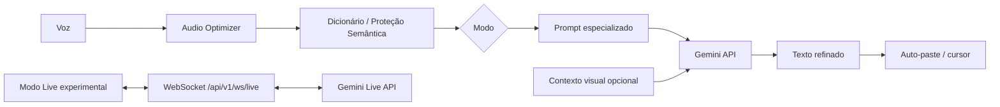

# 🎙️ RefinaVoz — Ditado Contextual & Copiloto de Voz Multimodal

<p align="center">
  
</p>

<p align="center">
  
  
  
  
  
  
</p>

**RefinaVoz** é um assistente de desktop open source para quem pensa mais rápido do que digita. Ele recebe sua fala, aplica um modo de escrita especializado, pode usar o contexto visual da janela ativa e devolve o texto refinado diretamente ao ponto em que você estava trabalhando.

O projeto nasceu com forte uso jurídico, mas também inclui modos para programação, mensagens, e-mail e escrita profissional. A proposta não é esconder a engenharia atrás de um SaaS: o código, os prompts, o backend, a interface e os testes estão abertos para inspeção e contribuição.

> **Estado atual:** beta público com foco e homologação primária no **Windows**. macOS e Linux fazem parte da arquitetura-alvo, mas ainda não possuem paridade funcional completa. Veja [Compatibilidade](#-compatibilidade-realista).

---

## ⚡ Fluxo principal

1. Posicione o cursor no Word, navegador, editor, IDE ou outro campo de texto.
2. Acione o atalho global e fale naturalmente.
3. O backend processa áudio + instruções do modo selecionado e, quando habilitado, contexto visual.
4. O texto refinado retorna ao aplicativo e é inserido no cursor.

A latência real depende do tamanho do áudio, rede, modelo configurado, disponibilidade da API e máquina do usuário. O projeto **não assume um SLA universal de milissegundos** sem benchmark reproduzível.



---

## 🧩 O que já existe no código

| Capacidade | Estado |
|---|---|
| Pipeline de áudio → refinamento → texto | ✅ Implementado |
| Modos Normal, Profissional, Jurídico e Programador/Vibe Code | ✅ Implementado |
| Dicionário local e proteção semântica | ✅ Implementado |
| Backend FastAPI + frontend React/Tauri | ✅ Implementado |
| Contexto multimodal com imagem da janela ativa | ✅ Implementado no fluxo Windows |
| Auto-paste e recuperação de foco | ✅ Windows |
| Gateway WebSocket para Live Voice | 🧪 Experimental |
| macOS com paridade completa de captura/injeção | 🚧 Em evolução |
| Linux/Wayland/X11 homologado | 🚧 Roadmap |
| Suite automatizada de backend | ✅ Presente em `testes/` |
| CI público | ✅ Configurado em `.github/workflows/ci.yml` nesta preparação de release |

O modo Live depende também da disponibilidade e do identificador vigente do modelo Live no provedor. Por isso ele é tratado como **experimental** até existir smoke test real e repetível contra a configuração corrente.

---

## 🧠 Modos de escrita

Os templates em `prompts/` especializam o mesmo motor para diferentes contextos:

- **Normal:** limpa hesitações, corrige pontuação e preserva a voz do usuário.
- **Profissional / Mensagem:** transforma fala solta em comunicação objetiva.
- **Jurídico:** usa vocabulário forense e estrutura compatível com trabalho jurídico, sem substituir revisão profissional.
- **Programador / Vibe Code:** preserva termos técnicos, nomes de variáveis e instruções de código.

O projeto também inclui uma camada jurídica leve para organização de contexto e proteção contra invenção de fatos ou autoridades. Ela é uma ferramenta de produtividade, **não uma fonte autônoma de aconselhamento jurídico**.

---

## 🔐 Privacidade e fluxo de dados

RefinaVoz é **local-first, não local-only**.

O aplicativo e seu backend rodam localmente por padrão. Dicionário, configurações e estados locais permanecem na máquina. Porém, quando o processamento por Gemini está habilitado, conteúdo necessário à inferência pode sair do computador, incluindo:

- áudio da fala;
- prompt e instruções contextuais;
- imagem da janela ativa quando o contexto visual for utilizado;
- demais dados que o usuário inserir deliberadamente no contexto enviado ao modelo.

A chamada é feita usando a chave configurada pelo próprio usuário em `.env`. O comportamento de retenção e tratamento do lado do provedor é regido pelos termos da conta/API utilizada.

Leia **[PRIVACY.md](PRIVACY.md)** antes de usar o projeto com informações profissionais, sigilosas ou de clientes. Vulnerabilidades devem seguir **[SECURITY.md](SECURITY.md)**.

---

## 🔑 Chaves e modelos

Copie `.env.example` para `.env` e configure sua própria chave do Google AI Studio/Gemini API:

```env
GEMINI_API_KEYS=sua_chave_aqui
USE_MOCK_LLM=false
```

É possível fornecer mais de uma chave configurada pelo próprio usuário. O cliente possui **failover entre chaves configuradas** quando uma chamada recebe erro de cota, sem alterar ou contornar as políticas e limites definidos pelo provedor.

Os modelos padrão ficam centralizados em `backend/core/config.py` e podem evoluir conforme a API do provedor. Antes de publicar benchmark ou habilitar Live em produção, valide os IDs vigentes na documentação oficial do Gemini.

---

## 💻 Compatibilidade realista

### Windows — plataforma principal

É o caminho atualmente mais completo: captura da janela ativa, recuperação de foco, injeção de texto e launcher local foram implementados com integração nativa Windows/Tauri.

### macOS — suporte parcial

A camada Tauri/React e partes do fluxo podem ser portadas, mas a implementação atual **ainda não possui paridade completa**, especialmente para captura nativa da janela ativa. Não anunciamos suporte 100% até os gates de plataforma passarem em hardware real.

### Linux — roadmap

O backend e o frontend web são portáveis, mas o fluxo desktop completo depende de integração específica para X11/Wayland, permissões e injeção de teclado. Linux ainda não é uma plataforma homologada do RefinaVoz.

---

## 🚀 Quick Start — Windows

### Pré-requisitos

- Python 3.11+
- Node.js compatível com `frontend/package.json`
- Rust + Cargo (`rustup`)
- Visual Studio Build Tools com **Desktop development with C++** para compilar o Tauri no Windows
- Uma chave Gemini API para uso real

> Não distribuímos instaladores de toolchain dentro do repositório. Baixe Rust, Node, Python e Visual Studio Build Tools somente das fontes oficiais.

### Instalação

```cmd
setup.bat
```

Edite `.env` e então inicie:

```cmd
abrir_filtro_de_fala.bat
```

Serviços de desenvolvimento:

- Frontend HUD: `http://localhost:1420`
- Backend FastAPI: `http://127.0.0.1:14201`
- Swagger: `http://127.0.0.1:14201/docs`

---

## 🧪 Testes e gates

Backend:

```bash
python -m pytest -q
```

Frontend:

```bash
cd frontend
npm ci
npm run build
```

Tauri/Rust:

```bash
cd frontend/src-tauri
cargo check --locked
```

O workflow público executa testes do backend, build TypeScript/Vite e `cargo check` no Windows. Testes que exercitam comportamento de LLM usam mocks/fakes quando possível; isso não substitui smoke tests reais da API e dos fluxos nativos de desktop.

---

## 🐾 Interface

<p align="center">
  
</p>

O HUD inclui mascotes/estados visuais reativos ao ciclo de captura, processamento e retorno. Essa camada existe para dar feedback rápido sem transformar o ditado em uma janela de chat tradicional.

---

## 🤝 Contribuindo

Pull requests são bem-vindos. Antes de alterar comportamento central, leia [CONTRIBUTING.md](CONTRIBUTING.md), [AGENTS.md](AGENTS.md) e os documentos de arquitetura em `docs/`.

Áreas particularmente úteis para contribuição:

- implementação/homologação macOS e Linux;
- testes nativos de captura, foco e auto-paste;
- smoke tests controlados para Gemini Live;
- redução de latência medida com benchmarks reproduzíveis;
- acessibilidade e ergonomia do HUD;
- documentação e exemplos de novos modos de escrita.

---

## 📄 Licença

Distribuído sob a **MIT License**. Consulte [LICENSE](LICENSE).

Criado e mantido por **Helder Petrica**.
