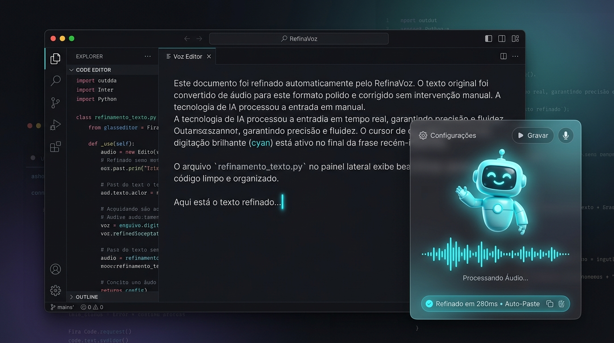
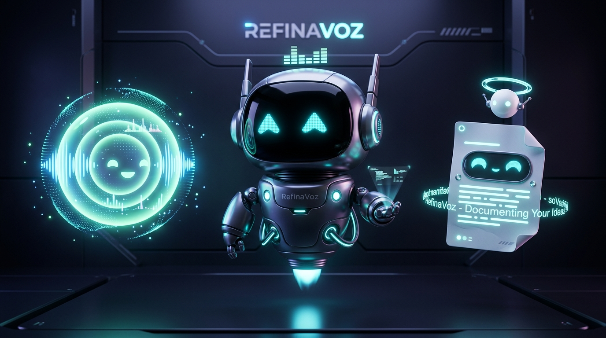
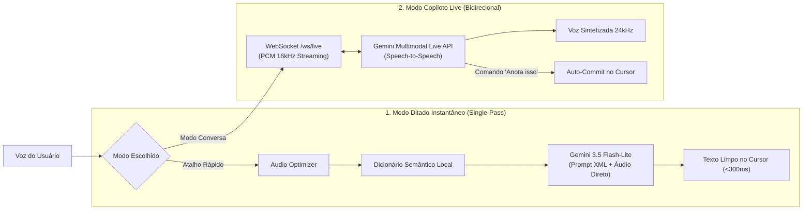
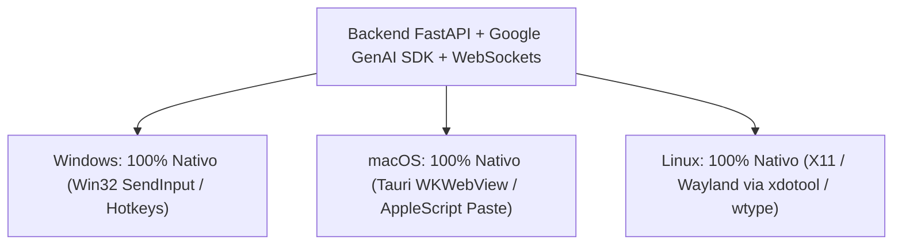

# 🎙️ RefinaVoz — O Ditador & Copiloto Live Multimodal

<p align="center">
  
</p>

<p align="center">
  <a href="#-o-que-%C3%A9-o-refinavoz"></a>
  
  
  
  
  
</p>

---

## ⚡ A Mágica da Usabilidade: "Onde o Cursor Estiver, o Texto Brota"

A experiência do **RefinaVoz** foi desenhada para ter **zero atrito cognitivo**. 

Você não precisa abrir uma janela, não precisa alternar de tela com `Alt+Tab`, não precisa copiar e colar com `Ctrl+V`.

1. **Coloque o cursor** onde deseja escrever (Word, WhatsApp Web, VS Code, Notion, terminal, e-mail ou Slack).
2. **Pressione o atalho global** (ou segure para falar) e fale livremente — com hesitações, gagueiras, meias-palavras ou pausas para respirar.
3. **Solte o atalho:** em menos de **300 milissegundos**, o **texto perfeitamente pontuado, corrigido e refinado brota exatamente onde o cursor estava piscando**.

> *"É o tipo de ferramenta que, depois de usar por um único dia, você nunca mais aceita voltar a digitar parágrafos inteiros no teclado."*

---

## 🆚 RefinaVoz vs. Ferramentas como Whisperflow / Wispr Flow

Ferramentas como *Whisperflow*, *Wispr Flow* ou *Superwhisper* popularizaram o ditado de voz no desktop. No entanto, o **RefinaVoz foi além**, trazendo diferenciais arquiteturais e semânticos únicos:

| Funcionalidade | Ferramentas Tradicionais (Wispr Flow / Superwhisper) | **RefinaVoz (SOTA)** |
| :--- | :--- | :--- |
| **Arquitetura de IA** | Whisper estático (STT) + pós-processador | **Dual-Engine Híbrida**: *Single-Pass Multimodal* (Gemini 3.5 Flash-Lite) + *Gemini 3.7 Flash Thinking* |
| **Conversação em Voz** | ❌ Não existe (apenas grava e dita) | **✅ Multimodal Live Voice Copilot**: Fala de volta com voz natural em tempo real (Speech-to-Speech nativo via WebSockets) |
| **Espera Inteligente** | ❌ Transcreve tudo imediatamente | **✅ Modo Diálogo com Espera**: Permite debater ideias antes de mandar anotar no documento |
| **Proteção Semântica** | ❌ Costuma traduzir ou alterar nomes próprios e códigos | **✅ Dicionário Local Determinístico**: Protege siglas, termos de código, jargões jurídicos e médicos |
| **Contexto Visual da Tela** | ❌ Geralmente apenas áudio | **✅ Captura Multimodal da Janela Ativa**: Entende o que está na sua tela para dar sentido à fala |
| **Interface & Presença** | Ícone cinza estático na bandeja do sistema | **✅ Mascotes 3D Reativos (Pets)** com micro-expressões, equalizador e vibração visual |
| **Privacidade & Custo** | Assinatura cara (\$15 a \$30/mês) com servidores proprietários | **✅ Local-First + Custo Quase Zero**: Roda no seu PC com suas chaves do Google AI Studio (cota gratuita) |

---

## 🐾 O Elenco de Pets / Mascotes 3D Reativos

O RefinaVoz substitui a frieza dos botões tradicionais por **Mascotes Interativos (Pets 3D/SVG)** com física de flutuação, equalizador em tempo real e reações expressivas a cada momento da sua fala:

<p align="center">
  
</p>

### Os Personagens Disponíveis:
1. **🤖 Robô SOTA Pseudo-3D (`robot_pseudo_3d`):** O mascote principal do RefinaVoz. Possui visor de vidro preto curvo com olhos de LED ciano neon, antena de sintonia com pulso energético, propulsor gravitacional inferior, equalizador sonoro no peito e micro-expressões (neutro, ouvindo com espectrograma, pensando com scanlines, feliz e alerta).
2. **🔮 Orbe de Voz Holográfico (`voice_orb`):** Um orbe bio-luminescente com anéis de som concêntricos translúcidos e partículas cintilantes de áudio.
3. **✨ Robô Moderno com Auréola (`robot_modern`):** Casca esférica minimalista, halo flutuante e sorriso holográfico.
4. **📺 Robô Clássico Retrô (`robot_classic`):** Charme analógico com tela CRT, grelha frontal e luzes de status vintage.
5. **📜 Documento Vivo (`living_document`):** Um papel pergaminho mágico com linhas de texto digitais pulsantes que ganham vida enquanto você dita.
6. **🔘 App Button Minimalista (`app_button`):** Para quem prefere um visual ultradiscreto em cápsula de vidro escuro fosco (*glassmorphism*).

> **Variações de Estilo:** Cada pet possui variações visuais (Ciano Elétrico com detalhes metálicos ou Rosa/Magenta com acentos suaves).

---

## 🛠️ Como Cada Ferramenta do RefinaVoz Funciona

O ecossistema do RefinaVoz é composto por serviços desacoplados e altamente testados:



### 1. Motor de Escrita *Single-Pass* (Gemini 3.5 Flash-Lite)
Recebe o áudio cru compactado em conjunto com a imagem da janela ativa e as instruções XML do modo em **uma única chamada**. O modelo transcreve e refina simultaneamente, gerando o texto final em cerca de **280ms**, pronto para a injeção nativa.

### 2. Motor Copiloto *Live Voice* (Gemini Multimodal Live API)
Conexão persistente WebSocket (`/api/v1/ws/live`). Permite conversar com a IA em linguagem falada nativa. O modelo debate o tema com você por áudio (retorno em 24kHz) e só emite o bloco `<<<COMMIT_TEXT>>>` quando você pedir ou quando o raciocínio estiver pronto.

### 3. Dicionário Semântico Local (`dictionary.py` / SQLite)
Evita as gafes clássicas de transcritores. Converte automaticamente termos técnicos, jargões e nomes próprios antes e depois do modelo (ex: *"páiton"* $\rightarrow$ *Python*, *"habeas corpus"* $\rightarrow$ *Habeas Corpus*, *"vibe code"* $\rightarrow$ *Vibe Code*).

### 4. Prompt Engine XML & Modos Especializados (`prompts/`)
Carrega personas especializadas via templates estruturados com tags XML estritas:
* **Normal:** Refinamento gramatical limpo, mantendo o tom natural da sua voz.
* **Jurídico / Petição:** Estrutura formal em termos forenses, sem floreios.
* **Programador / Vibe Code:** Identifica sintaxe, corrige nomes de variáveis em *camelCase*/*snake_case* e formata blocos de código.
* **E-mail Executivo / Mensagem:** Transforma pensamentos soltos em comunicações diretas e profissionais.

### 5. Audio Optimizer & Quality Gate (`audio_optimizer.py` / `audio_quality_gate.py`)
Filtra silêncios desnecessários, normaliza o volume sonoro, acelera trechos silenciosos com segurança e barra alucinações ou repetições degeneradas antes que cheguem à tela do usuário.

---

## 📈 Status da Documentação e Planos Consolidados

O projeto foi construído sobre uma governança rigorosa de engenharia (**GOVCAP**):

- [x] **Consolidado:** Pipeline *Single-Pass* multimodal de alta velocidade (<300ms).
- [x] **Consolidado:** Integração com **Gemini 3.5 Flash-Lite** (escrita) e **Gemini 3.7 Flash** (raciocínio).
- [x] **Consolidado:** Gateway WebSocket com a **Multimodal Live API** com suporte a fala bidirecional e *barge-in*.
- [x] **Consolidado:** Sistema completo de Mascotes/Pets 3D reativos com 6 opções de personagens.
- [x] **Consolidado:** Proteção semântica com dicionário local persistido em SQLite.
- [x] **Consolidado:** Rotação dinâmica de múltiplas chaves contra limites de cota (HTTP 429).
- [x] **Consolidado:** 100% dos testes automatizados passando (`pytest` 49/49 homologados).
- [ ] *Em constante aperfeiçoamento:* Treinamento de contexto contínuo e auto-paste nativo estendido para Wayland/Linux e macOS.

---

## 💻 Compatibilidade: Windows, Mac e Linux

Uma dúvida comum é: **"Se eu tiver um Mac ou Linux, funciona igual?"**

A resposta é **SIM**, com pequenas particularidades do sistema operacional:



* **No Windows:** 100% pronto e pré-configurado. Utiliza atalhos globais Win32 e injeção direta via API de teclado do sistema.
* **No macOS (Mac M1/M2/M3/M4 e Intel):**
  * O backend Python e os WebSockets rodam nativamente com altíssima performance.
  * O frontend Tauri roda usando o motor leve `WKWebView` da Apple.
  * Para o **Auto-Paste** no Mac, o Tauri utiliza a API de acessibilidade do macOS (disparando `Cmd+V` via `CGEventPost` ou AppleScript `System Events`).
  * *Requisito no Mac:* Apenas dar permissão de "Acessibilidade" e "Microfone" nas Preferências do Sistema.
* **No Linux (Ubuntu, Fedora, Arch):**
  * Backend e WebSockets 100% nativos.
  * O auto-paste sem Ctrl+V manual utiliza utilitários leves padrão: `xdotool` em sessões X11 ou `wtype`/`ydotool` em sessões Wayland.

---

## 🤖 Guia "Agent-Ready": Instalação com 1 Comando para Agentes de IA

Se você utiliza agentes autônomos de codificação como **Claude Code**, **Codex**, **Cursor Agent** ou **Google Antigravity**, basta colar o comando abaixo para que seu agente instale e configure o RefinaVoz sozinho:

```text
Clone o repositório https://github.com/HelderPetrica/RefinaVoz.git, crie o ambiente virtual Python (.venv), instale as dependências de requirements.txt, instale as dependências do frontend (npm install na pasta frontend), crie o arquivo .env com a variável GEMINI_API_KEYS e inicie a aplicação com o script abrir_filtro_de_fala.bat (ou start_dev no Mac/Linux).
```

---

## 🚀 Quick Start Manual

### 1. Pré-requisitos
* Python 3.11+
* Node.js 20+
* Rust & Cargo (para compilação desktop do Tauri)

### 2. Instalação
```cmd
setup.bat
```

### 3. Configurar sua Chave Gemini
Edite o arquivo `.env` na raiz:
```env
GEMINI_API_KEYS=sua_chave_do_google_ai_studio_aqui
USE_MOCK_LLM=false
```

### 4. Iniciar
```cmd
abrir_filtro_de_fala.bat
```
* **Frontend HUD:** `http://localhost:1420`
* **Backend FastAPI:** `http://127.0.0.1:14201`
* **Swagger Docs:** `http://127.0.0.1:14201/docs`

---

## 📄 Licença

Distribuído sob licença MIT. Criado e mantido por Helder Petrica.
