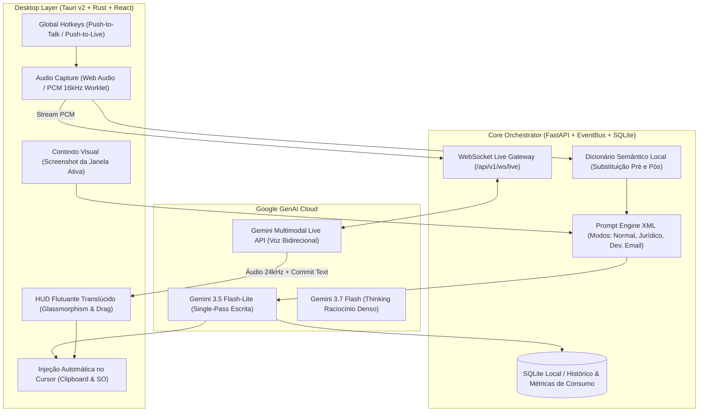

# 🎙️ RefinaVoz — Assistente Multimodal de Voz & Copiloto Live


O **RefinaVoz** é um assistente de voz desktop *local-first* de altíssima performance, projetado para eliminar o atrito entre o pensamento oral e a escrita final. Ele funciona tanto como um **ditador inteligente ultrarrápido** (que transforma fala fragmentada em texto polido e cola diretamente no cursor) quanto como um **Copiloto Live Conversacional** (que escuta, debate ideias por voz e só anota no documento quando o pensamento estiver concluído).

---

## 🌟 O Que Há de Novo (Arquitetura SOTA & Dual-Engine)

O RefinaVoz opera em um modelo de **Dupla Engine Inteligente**:

1. **⚡ Motor de Escrita Instantânea (*Single-Pass* com Gemini 3.5 Flash-Lite):**
   - Recebe o áudio gravado e o prompt XML do modo em **uma única chamada multimodal**.
   - Elimina a etapa intermediária de transcrição: **-50% de latência (<300ms)** e **-50% de custo de tokens**.
   - Injeta o texto refinado e corrigido diretamente no documento ou aplicativo em uso.

2. **🗣️ Motor Copiloto Live Voice (*Multimodal Live API* via WebSockets):**
   - **Diálogo Bidirecional Real-Time (Speech-to-Speech nativo):** O Gemini escuta o áudio contínuo do microfone (PCM 16kHz) e responde falando com voz natural (PCM 24kHz).
   - **Espera Inteligente:** Enquanto você estiver apenas conversando e debatendo ideias, o assistente mantém o diálogo em voz sem poluir a sua tela com rascunhos prematuros.
   - **Auto-Commit de Texto:** Ao concluir o raciocínio ou sob ordem verbal (*"anota isso"*, *"redija a minuta formal"*), o assistente emite o evento `commit_text`, cola a versão final onde seu cursor estiver e confirma por voz.
   - **Suporte a Interrupção (*Barge-in*):** Se você falar enquanto a IA estiver respondendo, ela para de falar instantaneamente para te ouvir.

3. **🧠 Motor de Raciocínio Denso (*Gemini 3.7 Flash* com Thinking Budget):**
   - Ativado para modos complexos (ex: minutas jurídicas longas, refatoração de código densa e arquitetura).

---

## 🏛️ Arquitetura do Sistema



---

## 📊 Medição e Monitoramento de Consumo

O RefinaVoz monitora com precisão cirúrgica todo o tráfego de dados para garantir transparência e custo quase zero:

* **Métricas em Cada Requisição (`ProcessingMetrics`):**
  * `latency_ms`: Tempo total de resposta do modelo.
  * `prompt_tokens`: Tokens de entrada consumidos (incluindo áudio e imagens).
  * `completion_tokens`: Tokens de saída gerados.
  * `provider_model`: Modelo exato que atendeu a requisição.
* **Histórico no SQLite Local (`refinavoz.db`):**
  * Todas as operações são gravadas na tabela `prompthistory` com carimbo de data/hora, modo utilizado e latência.
* **Estimativa de Custos Reais:**
  * **Gemini 3.5 Flash-Lite:** \$0.30 / 1M tokens de entrada e \$2.50 / 1M tokens de saída.
  * *Exemplo prático:* 1.000 refinamentos diários custam menos de **\$0,03 centavos de dólar por dia** (ou R$ 0,16/dia).

---

## 🚀 Como Executar o Projeto

### Pré-requisitos
* **Python 3.11+**
* **Node.js 20+**
* **Rust Toolchain & Microsoft C++ Build Tools** (para o binário do Tauri no Windows)

### 1. Configuração Inicial Automatizada
Execute no terminal da raiz do projeto:
```cmd
setup.bat
```
Isso criará o `.venv`, instalará todas as dependências do Python e do Node.js.

### 2. Configuração de Chaves (`.env`)
Abra o arquivo `.env` na raiz (criado a partir do `.env.example`) e adicione suas chaves do Google AI Studio:
```env
GEMINI_API_KEYS=sua_chave_aqui,outra_chave_opcional_aqui
USE_MOCK_LLM=false
```
> **Nota de Segurança:** O RefinaVoz suporta **rotação dinâmica de chaves**. Se você colocar múltiplas chaves separadas por vírgula, o sistema alternará automaticamente entre elas caso alguma atinja o limite de taxa (HTTP 429). O arquivo `.env` está estritamente protegido no `.gitignore` e **nunca** é versionado.

### 3. Iniciar a Aplicação
```cmd
abrir_filtro_de_fala.bat
```
* **Frontend:** `http://localhost:1420`
* **Backend FastAPI:** `http://127.0.0.1:14201`
* **Documentação Swagger:** `http://127.0.0.1:14201/docs`

---

## 🧪 Testes Automatizados e Qualidade

O projeto conta com suíte completa de testes automatizados com cobertura de ponta a ponta:

```cmd
.venv\Scripts\python -m pytest -v testes
```
* **49 testes homologados** cobrindo:
  - Rotação de chaves e resiliência a erros 429.
  - Injeção multimodal de áudio e imagem.
  - Conexão e streaming do Live WebSocket Gateway.
  - Dicionário semântico e renderização de prompts XML.
  - Otimização de áudio e portais de segurança.

---

## 🐧 Compatibilidade: Windows vs. Linux

| Funcionalidade | No Windows | No Linux | Observações de Portabilidade |
| :--- | :--- | :--- | :--- |
| **Backend FastAPI & AI Engines** | 100% Nativo | 100% Nativo | O backend Python com `google-genai` e `FastAPI` é totalmente agnóstico e roda sem alterações. |
| **Captura de Microfone & WebSockets** | 100% Nativo | 100% Nativo | Utiliza Web Audio API padrão e WebSockets RFC 6455. |
| **HUD Flutuante Translúcido** | 100% Nativo | Nativo (X11 / Wayland) | No Linux requer suporte a transparência de compositor (Mutter/KWin/Hyprland). |
| **Atalhos Globais (Hotkeys)** | Nativo (Tauri Windows Hook) | Nativo (X11) / Portal (Wayland) | No Wayland, atalhos globais exigem permissão via XDG Desktop Portal. |
| **Auto-Paste Direto no Cursor** | Nativo (Win32 SendInput) | `xdotool` (X11) / `wtype` (Wayland) | Para injeção no Linux sem Ctrl+V manual, utiliza-se a ferramenta de digitação do compositor. |

---

## 📄 Licença

Distribuído sob licença MIT. Veja `LICENSE` para mais detalhes.
