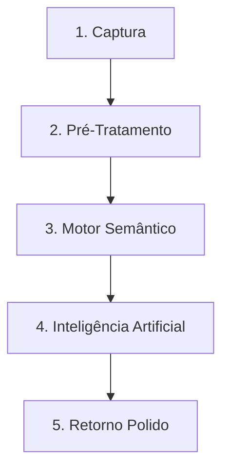

# 🧬 Blueprint Conceitual: A Alma do RefinaVoz

Este documento traduz a engenharia reversa do **RefinaVoz** de forma simples, abstrata e direta. Se você quer entender "o que" esse app faz e "como" ele pensa, este é o lugar.

---

## 👻 A Alma do App (O Conceito Central)

A missão do RefinaVoz atuar como um **filtro invisível e elegante** entre o que você diz (ou digita) e o que o mundo recebe. 

Imagine um tradutor simultâneo focado em *lapidação profissional*: você joga uma ideia bruta, com erros ou gírias num widget flutuante e transparente (o globo SOTA), e o sistema devolve instantaneamente um texto polido e inteligente.

A "mágica" não está na quantidade de código, mas na **separação estrita entre a interface leve e o cérebro pesado**.

---

## 🧠 A Lógica de Funcionamento (O Pipeline de Refino)

O processamento da informação segue uma linha de montagem simplificada:

### 1. Captura (O Widget Frontend)
- **Onde acontece:** Interface do usuário (Construída com *React + Tauri*).
- **Ação:** Um globo flutuante no seu desktop intercepta sua comunicação. Pode ser um texto digitado ou, no futuro, voz bruta. A interface é translúcida e não atrapalha o sistema operacional.

### 2. Tratamento Primário (Dicionário de Correções)
- **Onde acontece:** Servidor Local (*FastAPI / Python*).
- **Ação:** Antes da IA colocar as mãos na sua mensagem, o sistema roda correções automáticas rápidas.
- *Exemplo:* Se o áudio transcreveu "páiton", o sistema corrige instantaneamente para "Python".

### 3. Motor Semântico (As Máscaras da IA)
- **Onde acontece:** Arquivos Markdown (`.md`) na pasta `/prompts`.
- **Ação:** O sistema veste uma "persona" com base no estilo de texto que você deseja (ex: formal, amigável, técnico). Ele também acopla o contexto do que você está vendo na tela, tudo isso através de formatações XML invisíveis.

### 4. Inteligência (O Processamento Misto)
- **Onde acontece:** Comunicação com a API do Google Gemini (ou Mock Local).
- **Ação:** O texto montado é enviado para a IA refinar o conteúdo. Para economizar dinheiro ou testar, o sistema pode usar um modo simulação (`Mock Mode`) que não gasta chaves reais de API.

### 5. Finalização (O Resultado)
- O texto chega formatado perfeitamente de volta para o Widget.

---

## 🏗️ O Esqueleto Técnico (Como as peças conversam)

- **A Casca (Tauri + Rust + React):** Cuida apenas dos visuais, de ser arrastável e parecer premium na janela do Windows.
- **O Motor (FastAPI):** Um servidor que roda localmente de forma isolada, processando regras pesadas, lidando com chaves de API e manipulando texto.
- **Os Prompts (.md):** Arquivos soltos, criados para que os desenvolvedores consigam melhorar "as personalidades" e lógicas da IA sem precisar editar o código fonte.

> **Resumo:** O RefinaVoz não é um chat. É um "filtro" instantâneo de background. Ele é leve na tela, mas esconde um processador pesado e robusto de inteligência linguística por baixo do capô.
