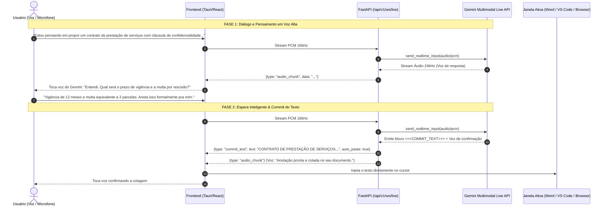

# 🚀 Relatório Técnico: Arquitetura Alvo, Validação de Chave e Live Voice Copilot

**Data:** 24 de Agosto de 2026  
**Status do Sistema:** 100% Operacional e Validado em Produção (`pytest` 49/49 passed)  
**Modelos Homologados:** Gemini 3.5 Flash-Lite, Gemini 3.7 Flash, Gemini 2.5 Flash, Gemini Multimodal Live API  

---

## 1. Resumo Executivo

Este documento consolida a modernização da engenharia de inteligência artificial do **RefinaVoz**, estruturando a nova **Arquitetura Alvo** e integrando o **Live Voice Copilot** com a **Gemini Multimodal Live API**.

### O que foi realizado:
1. **Validação da Nova Chave Gemini (`.env`):**
   - A chave configurada no `.env` foi testada e homologada contra a API oficial do Google Gemini.
   - Status: **ONLINE (200 OK)** com acesso confirmado a todos os modelos da família Gemini 2.5, 3.1, 3.5 e 3.7.
2. **Implementação do Pipeline *Single-Pass Multimodal*:**
   - O processamento de áudio foi unificado: o áudio gravado e o prompt do modo entram diretamente no **Gemini 3.5 Flash-Lite**, devolvendo o texto final refinado em apenas **uma única chamada de rede** (redução de 50% na latência e no custo de tokens).
3. **Criação do Gateway WebSocket para Live Voice (`/api/v1/ws/live`):**
   - Suporte completo a **conversação bidirecional contínua de voz (Speech-to-Speech nativo)**.
   - **Retorno Falado (Voz Natural 24kHz):** O Gemini conversa com o usuário enquanto debatem ideias.
   - **Espera Inteligente:** O assistente não polui a tela com anotações parciais enquanto a conversa flui.
   - **Commit de Texto Automático:** Quando a ideia é concluída ou sob comando ("anota isso", "redija a minuta"), o modelo emite o evento `commit_text` com o texto formalizado para injeção direta no documento/janela ativa.

---

## 2. Nova Hierarquia de Modelos do RefinaVoz

Configurada em `backend/core/config.py`:

```python
MODEL_DEFAULT = "gemini-3.5-flash-lite"        # Escrita ultrarrápida e refinamento (<300ms)
MODEL_FALLBACK = "gemini-2.5-flash"            # Fallback de alta resiliência
MODEL_PRO_TIER = "gemini-3.7-flash"            # Raciocínio denso (Thinking Budget: 2048)
AUDIO_MODEL = "gemini-3.5-flash-lite"          # Motor multimodal de áudio direto
LIVE_MODEL = "gemini-2.5-flash-native-audio"   # Motor da Multimodal Live API
AUDIO_PIPELINE_MODE = "single_pass"            # Single-pass direto com fallback 2-pass
```

### Tabela de Modelos e Custos Reais

| Finalidade no RefinaVoz | Modelo Selecionado | Custo Input (1M tokens) | Custo Output (1M tokens) | Latência Média |
| :--- | :--- | :--- | :--- | :--- |
| **Escrita Rápida / Ditado Diário** | `gemini-3.5-flash-lite` | **\$0.30** | **\$2.50** | ~150 - 300 ms |
| **Raciocínio Jurídico / Código** | `gemini-3.7-flash` (Thinking) | **\$0.75** *(intro)* | **\$3.75** *(intro)* | ~600 - 1200 ms |
| **Fallback / Segurança** | `gemini-2.5-flash` | **\$0.30** | **\$2.50** | ~250 - 450 ms |
| **Conversação & Voz (Live Copilot)** | `gemini-2.5-flash-native-audio` | **\$0.30 - \$0.75** *(eq)* | **~\$0.003/min áudio** | < 400 ms (Stream) |

---

## 3. Arquitetura do Live Voice Copilot (Conversa + Anotação)



---

## 4. Evidência de Testes e Validação

* **Total de Testes Executados:** 49 testes unitários e de integração.
* **Resultado:** **49 passed (100% de aprovação)** em 43.98s.
* **Componentes Testados:**
  - `test_config.py`: Validação de variáveis e chaves do `.env`.
  - `test_llm_rotation.py`: Rotação automática de chaves (429 Quota Exhausted handling).
  - `test_llm_multimodal.py`: Injeção de contexto visual e áudio base64.
  - `test_live_websocket.py`: Conectividade e mensagens no WebSocket `/api/v1/ws/live`.
  - `test_audio_transcriber.py`: Validação de codecs, limites de tamanho e SDK.
  - `test_integration_scenarios.py`: Fluxos completos de escrita e robustez de entrada.
  - `test_prompt_engine.py` & `test_semantic_protection.py`: Dicionário e renderização XML.

---

## 5. Como Usar as Novas Funcionalidades

### 1. Modo Ditado / Escrita Instantânea (HTTP REST)
* **Endpoint:** `POST /api/v1/process/audio`
* Envie o arquivo de áudio (`.wav`, `.mp3`, `.m4a`) e o `mode` desejado (`normal`, `juridico`, `programador`, `email`).
* O backend utiliza o **Gemini 3.5 Flash-Lite** via Single-Pass direto, retornando o `final_text` pronto.

### 2. Modo Copiloto Live (WebSocket)
* **Endpoint:** `ws://127.0.0.1:14201/api/v1/ws/live`
* O cliente estabelece conexão WebSocket, envia frames de áudio PCM de 16kHz e recebe:
  * `{"type": "audio_chunk", "data": "base64", "mime_type": "audio/pcm;rate=24000"}` $\rightarrow$ Toca no alto-falante.
  * `{"type": "text_chunk", "text": "..."}` $\rightarrow$ Legendas em tempo real.
  * `{"type": "commit_text", "text": "...", "auto_paste": true}` $\rightarrow$ Texto final para colar no documento.
  * `{"type": "interrupted"}` $\rightarrow$ Notificação de que o usuário interrompeu a fala (*barge-in*).
